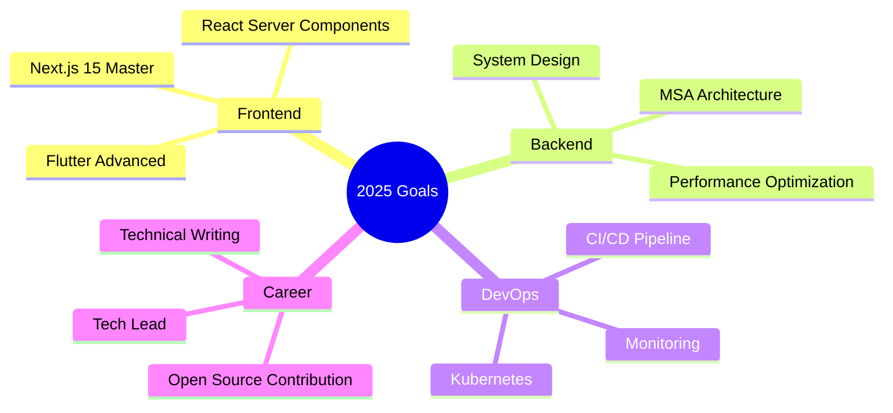

<div align="center">

<!-- 동적 타이핑 효과 -->
[](https://git.io/typing-svg)

<!-- 프로필 뷰 카운터 -->


<!-- 소셜 뱃지 -->
[](https://dongkyukim.com)
[](mailto:wlsntus55@gmail.com)
[](https://begin-developer.tistory.com/)

</div>

---

## 🎯 About Me

```typescript
const dongkyukim = {
  role: "Full Stack Developer",
  location: "Seoul, South Korea 🇰🇷",
  education: "Konkuk University - English & Business Administration",
  experience: ["AIDU Education Platform", "DevHub", "LittleBank", "10+ Projects"],
  currentFocus: ["Next.js 15", "Flutter", "MSA", "AI Integration"],
  philosophy: "매일한다. 📚",
  
  techStack: {
    languages: ["TypeScript", "Python", "Java", "Dart", "JavaScript"],
    frontend: ["Next.js", "React", "React Native", "Flutter", "Vue.js"],
    backend: ["Django", "Spring Boot", "Node.js", "FastAPI"],
    database: ["PostgreSQL", "MySQL", "MongoDB", "Redis"],
    cloud: ["AWS", "Docker", "Kubernetes", "GitHub Actions"],
  },
  
  contact: () => "wlsntus55@gmail.com"
};
```

---

## 🏆 Achievements & Certifications

<div align="center">

| 🎖️ Certification | 📅 Date |
|:---:|:---:|
| **정보처리기사(필기)** | 2024.09 |
| **SQLD** | 2024.06 |
| **소프트웨어인재개발원 수료** | 2024.08 |

</div>

---

## ⚡ Tech Stack

<div align="center">

### 💻 Languages


### 🚀 Frontend


### 🔧 Backend


### 🗄️ Database & Cache


### ☁️ Cloud & DevOps


</div>

---

## 🔥 Featured Projects

<div align="center">

### 🎓 AIDU - AI Education Platform
[](https://aiduapp.com)
[](https://teacher.aiduapp.com)

</div>

> **학생/선생님을 위한 AI 기반 과학·영어 학습 플랫폼**

```
🔹 Tech: Django REST Framework | Next.js | React Native (Expo) | PostgreSQL | Redis | AWS
🔹 Features: Cognito 인증 | 학습 세트 시스템 | TA 개입 | 실시간 진도 관리
🔹 Role: Full Stack Developer - 백엔드 API, 프론트엔드, 모바일 앱, AWS 인프라
```

---

<div align="center">

### 🌌 KOSMO - MBTI & AI Prediction Platform
[](https://github.com/dongkyukim1)

</div>

> **MBTI 성격 분석 및 AI 기반 예측 서비스 플랫폼**

```
🔹 Tech: Next.js 16 | React 19 | Spring Boot 3.4 | PostgreSQL | Redis | Flutter
🔹 Features: MBTI 테스트 | 궁합 분석 | AI 예측 시각화 | 관리자 대시보드 | 모바일 앱
🔹 Role: Full Stack Developer - 프론트엔드, 백엔드, 모바일 앱 전체 개발
```

---

<div align="center">

### 🏦 LittleBank - Kids Goal Tracker App
[](https://github.com/dongkyukim1/littlebank_prod)

</div>

> **아이들을 위한 목표 설정 및 용돈 관리 Flutter 앱**

```
🔹 Tech: Flutter | Dart | Provider | Material Design 3
🔹 Features: 목표 설정 | 진행도 시각화 | 용돈 적립 | 성취 보상 시스템
🔹 Role: Solo Developer - Flutter UI/UX 설계 및 전체 개발
```

---

<div align="center">

### 🔗 DevHub - Version Control Platform
[](https://github.com/dongkyukim1/devhub-server)

</div>

> **Git 기반 형상 관리 및 협업 플랫폼 (5인 팀 프로젝트)**

```
🔹 Tech: Spring Boot | Flask | MySQL | Docker | AWS | OpenAI API
🔹 Features: 프로젝트 관리 | 이슈 트래킹 | PR/코드 리뷰 | AI 코드 리뷰
🔹 Role: Project Manager & Frontend Lead
```

---

<div align="center">

### 🏠 MyHouse - Housing Subscription Platform
[](https://github.com/dongkyukim1/myhouse)

</div>

> **주택 청약 정보 플랫폼**

```
🔹 Tech: Next.js | TypeScript | Tailwind CSS
🔹 Features: 청약 일정 | 자격 확인 | 정보 조회
```

---

## 📊 GitHub Analytics

<div align="center">


</div>

<div align="center">


</div>

<div align="center">

[](https://github.com/ashutosh00710/github-readme-activity-graph)

</div>

---

## 🎯 Current Focus

<div align="center">



</div>

---

## 💼 Experience Timeline

```
2024.09 - Present  │ 🚀 AIDU - Full Stack Developer (Django, Next.js, React Native)
2024.03 - 2024.08  │ 📚 소프트웨어인재개발원 개발자 과정 수료
2022.12 - 2023.06  │ 🌏 태흥엔지니어링 해외출장 담당자
2017.03 - 2022.12  │ 🛒 스마트스토어 운영 (한정판 브랜드)
2016.06 - 2017.02  │ 📖 영어강사 (초4 ~ 고3)
2016.07            │ 🎓 University of Mississippi 교환학생
2017.04            │ 🎓 건국대학교 졸업 (영어학과 · 경영학과)
```

---

## 🤝 Let's Connect

<div align="center">

[](https://dongkyukim.com)
[](mailto:wlsntus55@gmail.com)
[](https://begin-developer.tistory.com/)
[](https://github.com/dongkyukim1)

</div>

---

<div align="center">

### 💬 Random Dev Quote

[](https://github.com/piyushsuthar/github-readme-quotes)

</div>

---

<div align="center">

**Thanks for visiting! Let's build something amazing together 🚀**


</div>

