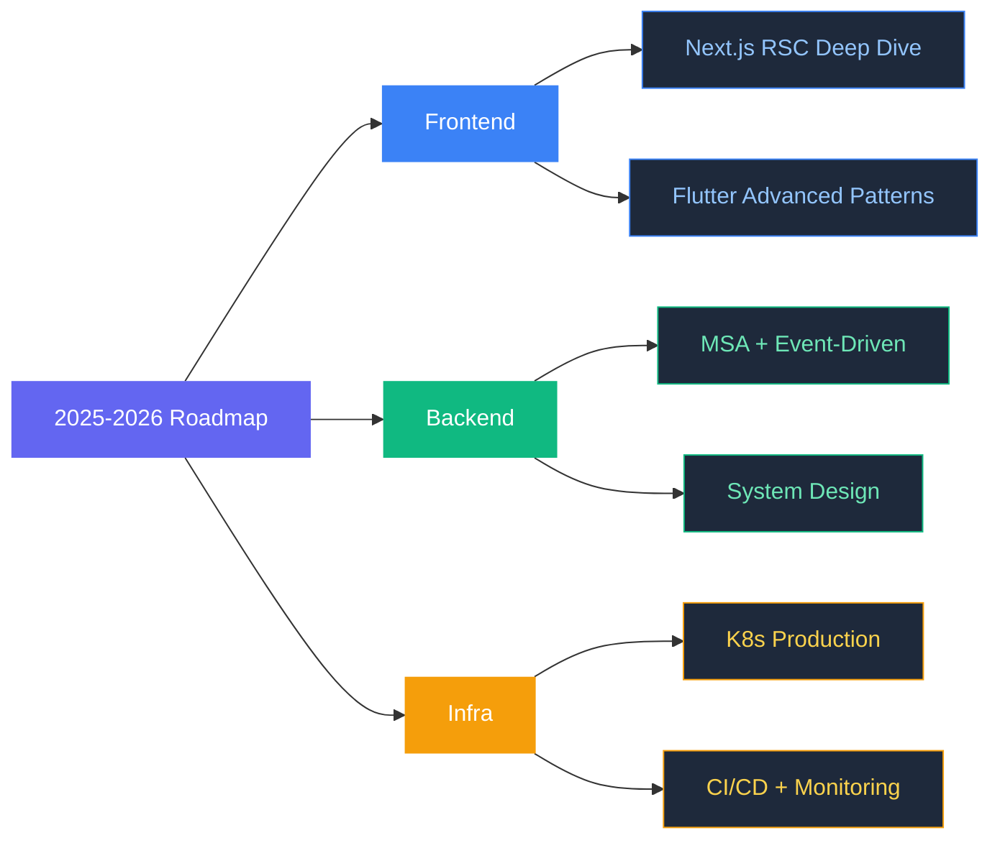

<div align="center">

<!-- HEADER: 3D 텍스트 애니메이션 -->


<!-- 타이핑 효과 -->
<a href="https://git.io/typing-svg">
  
</a>

<br/>

<!-- 소셜 뱃지 -->
<a href="https://dongkyukim.com"></a>
<a href="mailto:wlsntus55@gmail.com"></a>
<a href="https://begin-developer.tistory.com/"></a>


</div>

<br/>

## `$ whoami`

```typescript
const dongkyu = {
  role: "Full Stack Developer",
  location: "Seoul, South Korea",
  education: "Konkuk University — English & Business Administration",
  philosophy: "매일한다.",

  stack: {
    frontend:  ["Next.js 16", "React 19", "Flutter", "React Native", "Tailwind"],
    backend:   ["Django REST", "Spring Boot 3.4", "FastAPI", "Node.js"],
    database:  ["PostgreSQL", "Redis", "MongoDB", "MySQL"],
    infra:     ["AWS (ECS/RDS/ALB)", "Docker", "GitHub Actions", "Vercel"],
    languages: ["TypeScript", "Python", "Java", "Dart"],
  },

  currentWork: {
    "AIDU": "AI 교육 플랫폼 — Django + Next.js + React Native + AWS",
    "KOSMO": "GPS 러닝 플랫폼 — Spring Boot + Next.js + Flutter",
  },
};
```

<br/>

## Architecture I Build

> 실제 운영 중인 시스템의 아키텍처입니다.

```
                    ┌─────────────────────────────────────────────────┐
                    │              AWS Cloud (ap-northeast-2)          │
                    │                                                  │
  ┌──────────┐     │   ┌──────────┐    ┌──────────┐    ┌──────────┐  │
  │  Next.js  │────▶│   │   ALB    │───▶│   ECS    │───▶│   RDS    │  │
  │ (Vercel)  │     │   │          │    │ (Fargate)│    │(Postgres)│  │
  └──────────┘     │   └──────────┘    └────┬─────┘    └──────────┘  │
                    │                        │                         │
  ┌──────────┐     │                   ┌────▼─────┐    ┌──────────┐  │
  │  Flutter  │────▶│                   │  Redis   │    │    S3    │  │
  │   (App)   │     │                   │ (Cache)  │    │ (Assets) │  │
  └──────────┘     │                   └──────────┘    └──────────┘  │
                    │                                                  │
  ┌──────────┐     │   ┌──────────┐    ┌──────────┐                  │
  │React Natv│────▶│   │ Cognito  │    │CloudWatch│                  │
  │  (Expo)  │     │   │  (Auth)  │    │(Monitor) │                  │
  └──────────┘     │   └──────────┘    └──────────┘                  │
                    └─────────────────────────────────────────────────┘

  Client Layer          Gateway          Compute           Data Layer
```

<br/>

## Tech Radar

<div align="center">
<table>
<tr>
<td align="center" width="110">

<br/><b>TypeScript</b>
</td>
<td align="center" width="110">

<br/><b>Python</b>
</td>
<td align="center" width="110">

<br/><b>Java</b>
</td>
<td align="center" width="110">

<br/><b>JavaScript</b>
</td>
<td align="center" width="110">

<br/><b>Dart</b>
</td>
</tr>
<tr>
<td align="center" width="110">

<br/><b>React 19</b>
</td>
<td align="center" width="110">

<br/><b>Next.js 16</b>
</td>
<td align="center" width="110">

<br/><b>Flutter</b>
</td>
<td align="center" width="110">

<br/><b>Django</b>
</td>
<td align="center" width="110">

<br/><b>Spring Boot</b>
</td>
</tr>
<tr>
<td align="center" width="110">

<br/><b>Docker</b>
</td>
<td align="center" width="110">

<br/><b>AWS</b>
</td>
<td align="center" width="110">

<br/><b>Kubernetes</b>
</td>
<td align="center" width="110">

<br/><b>GraphQL</b>
</td>
<td align="center" width="110">

<br/><b>GitHub Actions</b>
</td>
</tr>
<tr>
<td align="center" width="110">

<br/><b>PostgreSQL</b>
</td>
<td align="center" width="110">

<br/><b>Redis</b>
</td>
<td align="center" width="110">

<br/><b>MongoDB</b>
</td>
<td align="center" width="110">

<br/><b>Tailwind</b>
</td>
<td align="center" width="110">

<br/><b>FastAPI</b>
</td>
</tr>
</table>
</div>

<br/>

## Featured Projects

<table>
<tr>
<td width="50%" valign="top">

###  AIDU — AI Education Platform
> **학생/선생님을 위한 AI 기반 과학 + 영어 학습 플랫폼**

<a href="https://aiduapp.com"></a>
<a href="https://teacher.aiduapp.com"></a>

```
Backend   Django REST + Celery + PostgreSQL + Redis
Frontend  Next.js 15 + Zustand + Tailwind
Mobile    React Native (Expo)
Infra     AWS ECS + RDS + S3 + Cognito + CloudWatch
```

**Key Contributions:**
- Cognito 기반 멀티테넌트 인증 시스템 설계
- 학습 세트 + TA 개입 실시간 관리 API 60+ 개 구현
- 학생/선생님/관리자 3개 프론트엔드 + 모바일 앱 개발
- AWS ECS Fargate 기반 프로덕션 인프라 구축

</td>
<td width="50%" valign="top">

###  KOSMO — GPS Running Platform
> **GPS 러닝 트래킹 + 영토 정복 + 크루 챌린지 플랫폼**

<a href="https://github.com/dongkyukim1"></a>

```
Backend   Spring Boot 3.4 + JPA + PostgreSQL + Redis
Frontend  Next.js 16 + React 19 + Zustand + Recharts
Mobile    Flutter + KakaoMap + GPS Tracking
Infra     AWS ECS + RDS + ElastiCache + ALB
```

**Key Contributions:**
- Spring Boot + JWT/OAuth2 인증 시스템 설계
- GPS 기반 러닝 트래킹 + 그리드 영토 정복 로직
- KakaoMap/OSM 기반 실시간 맵 렌더링
- 관리자 대시보드 + 랭킹 리더보드 구현

</td>
</tr>
<tr>
<td width="50%" valign="top">

###  LittleBank — Kids Goal Tracker
> **아이들을 위한 목표 설정 + 용돈 관리 앱**

<a href="https://github.com/dongkyukim1/littlebank_prod"></a>

```
Mobile    Flutter + Dart + Provider
Design    Material Design 3 + Custom Animations
```

**Key Contributions:**
- Solo Developer — 기획부터 배포까지 전체 개발
- 목표 설정 + 진행도 시각화 + 보상 시스템
- Custom Widget 기반 인터랙티브 UI

</td>
<td width="50%" valign="top">

###  DevHub — Version Control Platform
> **Git 기반 형상 관리 + 협업 플랫폼 (5인 팀)**

<a href="https://github.com/dongkyukim1/devhub-server"></a>

```
Backend   Spring Boot + Flask + MySQL
AI        OpenAI API (Code Review)
Infra     Docker + AWS
```

**Key Contributions:**
- Project Manager + Frontend Lead
- 이슈 트래킹 + PR/코드 리뷰 시스템 구현
- OpenAI 기반 AI 자동 코드 리뷰 기능 개발

</td>
</tr>
</table>

<br/>

## GitHub Analytics

<div align="center">


</div>

<div align="center">

[](https://github.com/dongkyukim1)

</div>

<br/>

## Experience & Certifications

```
2024.09 - Present  AIDU         Full Stack Developer (Django, Next.js, React Native, AWS)
2024.09            정보처리기사(필기) 취득
2024.06            SQLD 취득
2024.03 - 2024.08  소프트웨어인재개발원 개발자 과정 수료
2022.12 - 2023.06  태흥엔지니어링 해외출장 담당자
2017.03 - 2022.12  스마트스토어 운영 (한정판 브랜드)
2016.06 - 2017.02  영어강사 (초등~고등)
2016.07            University of Mississippi 교환학생
2017.04            건국대학교 졸업 (영어학과 + 경영학과)
```

<br/>

## What I'm Working On


```mermaid
graph LR
    A["2025-2026 Roadmap"] --> B["Frontend"]
    A --> C["Backend"]
    A --> D["Infra"]
    
    B --> B1["Next.js RSC Deep Dive"]
    B --> B2["Flutter Advanced Patterns"]
    
    C --> C1["MSA + Event-Driven"]
    C --> C2["System Design"]
    
    D --> D1["K8s Production"]
    D --> D2["CI/CD + Monitoring"]
    
    style A fill:#6366F1,stroke:none,color:#fff
    style B fill:#3B82F6,stroke:none,color:#fff
    style C fill:#10B981,stroke:none,color:#fff
    style D fill:#F59E0B,stroke:none,color:#fff
    style B1 fill:#1e293b,stroke:#3B82F6,color:#93c5fd
    style B2 fill:#1e293b,stroke:#3B82F6,color:#93c5fd
    style C1 fill:#1e293b,stroke:#10B981,color:#6ee7b7
    style C2 fill:#1e293b,stroke:#10B981,color:#6ee7b7
    style D1 fill:#1e293b,stroke:#F59E0B,color:#fcd34d
    style D2 fill:#1e293b,stroke:#F59E0B,color:#fcd34d
```

<br/>

---

<div align="center">

<a href="https://dongkyukim.com"></a>
<a href="mailto:wlsntus55@gmail.com"></a>
<a href="https://begin-developer.tistory.com/"></a>

<br/><br/>


</div>
